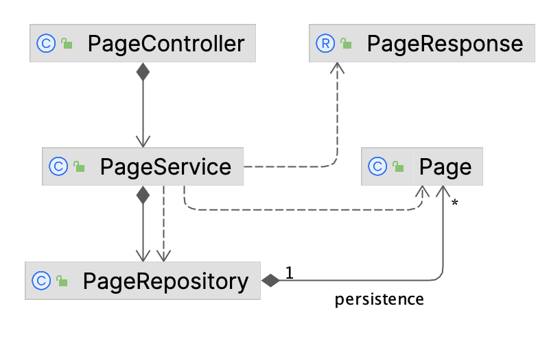
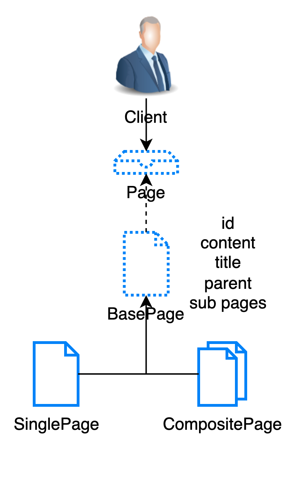

## 목표

노션과 유사한 간단한 페이지 관리 API를 구현해주세요. 각 페이지는 제목, 컨텐츠, 그리고 서브 페이지를 가질 수 있습니다. 또한, 특정 페이지에 대한 브로드 크럼스(Breadcrumbs) 정보도 반환해야 합니다.

## 요구사항

**페이지 정보 조회 API**: 특정 페이지의 정보를 조회할 수 있는 API를 구현하세요.

- 입력: 페이지 ID
- 출력: 페이지 제목, 컨텐츠, 서브 페이지 리스트, **브로드 크럼스 ( 페이지 1 > 페이지 3 > 페이지 5)**
- 컨텐츠 내에서 서브페이지 위치 고려 X

## 구현 내용

### 테이블 구조



### 비즈니스 로직

- 페이지 생성과 조회
- 현재, PageService의 `initializeSampleData()` 메서드를 통해 샘플 데이터를 생성하고 있다.

  ```java
    @PostConstruct
    private void initializeSampleData() {
        List<Page> pages = new ArrayList<>();
        Random random = new Random();

        for (int i = 1; i <= 10; i++) {
            Page samplePage = new Page("Title " + i, "Content " + i);
            if (i > 1) {
                int parentIndex = random.nextInt(i - 1);
                pages.get(parentIndex).addSubPage(samplePage);
            }

            savePage(samplePage);
            pages.add(samplePage);
        }
    }
  ```

### 결과 정보

- 가장 상위 페이지

```json
{
  "title": "Title 1",
  "content": "Content 1",
  "subpages": [
    2,
    3,
    4
  ],
  "breadcrumbs": "1"
}
```

- 하위 페이지들

```json
{
  "title": "Title 2",
  "content": "Content 2",
  "subpages": [
    5
  ],
  "breadcrumbs": "1/2"
}
```

```json
{
  "title": "Title 5",
  "content": "Content 5",
  "subpages": [
    6,
    7
  ],
  "breadcrumbs": "1/2/5"
}
```

```json
{
  "title": "Title 7",
  "content": "Content 7",
  "subpages": [
  ],
  "breadcrumbs": "1/2/5/7"
}
```

### 구현 과정

1. **Composite 패턴**

각각의 페이지는 트리 구조를 가지고 있기 때문에 composite 패턴을 통해 구현하는 것을 먼저 고려했다.

그림으로 이를 표현하면 이런 모양을 띄게 된다.



1. Page interface는 서브 페이지가 없는 SinglePage와 서브 페이지가 있는 CompositePage가 공통으로 가지고 있는 메서드를 정의한다.
2. BasePage는 Page interface의 구현체들인 SinglePage와 CompositePage가 공통으로 가지고 있는 필드와 메서드를 정의한다.
3. SinglePage, CompositePage는 BasePage를 상속받아 필요한 메서드를 구현한다.

- BasePage는 기본적으로 subPages 필드를 가지고 있는데, 기본적으로 null로 초기화되어 있다.
- SinglePage는 이를 그대로 사용하지만, CompositePage는 이 필드를 ArrayList로 초기화한다.

이렇게 구현하게 되면, 부모가 SinglePage인지 CompositePage인지에 따라서 상황에 따른 로직이 바뀌게 된다.

- 새로운 페이지를 생성하는 경우, parentPage가 SinglePage라면 parentPage페이지를 CompositePage로 변경하고, parent 페이지의 subPages 필드에 자신을 추가한다.

- 페이지를 삭제할 때, parent의 subPages 리스트의 사이즈가 0이 된다면, parentPage를 SinglePage로 변경한다.

SinglePage나 CompositePage를 구분하여 관리할 수 있게 되지만, 로직의 복잡성이 증가하게 된다.

2. **현재 구조**

위의 구조가 아닌, Page 단일 클래스에서 모든 로직을 처리하도록 구현하였다.

```java
public class Page {
    
    private final String title;
    private final String content;
    private final List<Page> subPages;
    private Page parentPage;

    public String getBreadcrumbs() {
        if (parentPage == null) {
            return String.valueOf(id);
        }
        return parentPage.getBreadcrumbs() + "/" + id;
    }

    public void setParentPage(Page parentPage) {
        this.parentPage = parentPage;
    }

    public boolean isComposite() {
        return !subPages.isEmpty();
    }

    public void addSubPage(Page page) {
        subPages.add(page);
        page.setParentPage(this);
    }

    public void removeSubPage(Page page) {
        subPages.remove(page);
    }
}
```

- getBreadcrumbs(): 현재 페이지의 브로드 크럼스를 반환한다.
  - 재귀적으로 부모 페이지의 브로드 크럼스를 가져와서 현재 페이지의 id를 추가한다.

부모 페이지와 서브 페이지 저장 방식에서의 구현 이유

- 객체를 직접 저장하는 방식(현재의 방식)
  - 데이터 참조를 직접할 수 있고, 객체 지향적
- 페이지 ID를 저장하는 방식
  - 메모리 사용량이 적고, 순환 참조 문제를 방지할 수 있다.

객체간의 관계를 좀 더 명확하게 표현하기 위해서 현재의 방식을 선택했다.
또한 ORM을 따로 사용하지 않는 상태이므로 객체를 직접 저장하는 방식이 더 적합하다고 판단했다.
